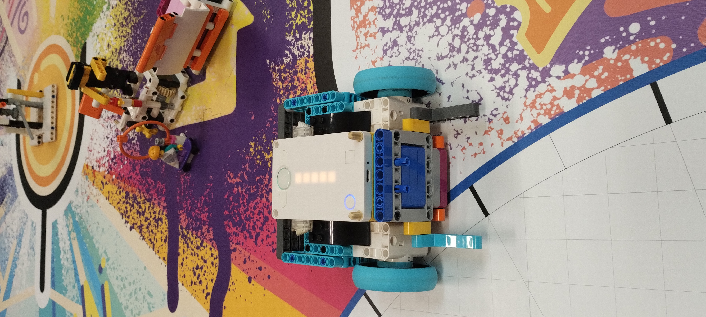
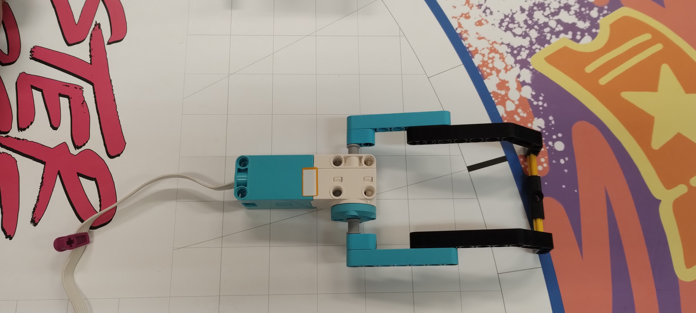
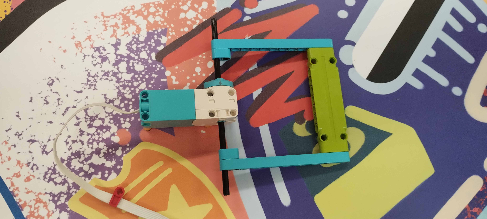
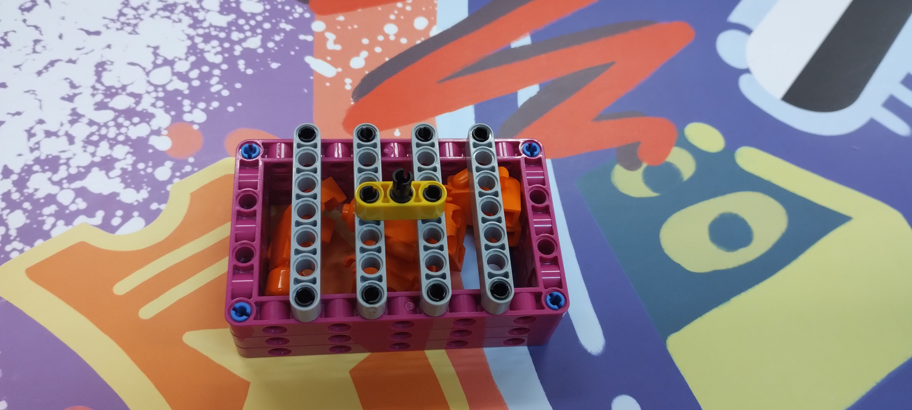

# Sobre a equipe 
Prazer em conhece-los, nos somos os São Rockets. 
Viemos do Sesi ce-400  da cidade de São Roque, a nossa equipe é formada pelos integrantes: Leonardo, Davi, João, Luís, Leticia, Vinícius e a nossa técnica Juliana. 
Criamos este repositório para registrar a construção do nosso robô carinhosamente chamado de "Vitor" e nosso projeto Color Magic.
O nosso robô foi carinhosamente apelidado de “Vitor” inspirado no nome do nosso ajudante Vitor Weber. 
O “Vitor” tem dois tipos de garra diferente, uma possui uma barra verde, que será usada para fazer as missões do cinema, teatro, experiencia imersiva e som. A outra garra é uma garra mais tradicional, ela fara as missões do palco e da impressora. Para entregar o público fizemos uma gaiola, ela irá presa na garra, e quando chegar no local a garra irá levantar e deixar o público lá, além disse essa gaiola vai empurrar o carro banana.  
O robô e bem compacto e foi desenvolvido pensando em todos as missões que iremos fazer e para trocarmos rapidamente a garra. 
### foto do robô "Vitor"

### foto das garras

### foto da equipe 
